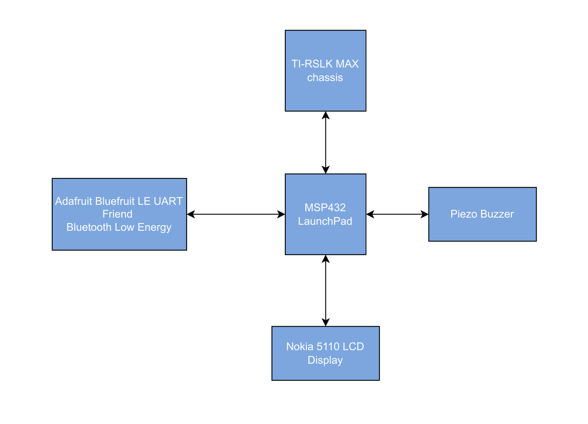
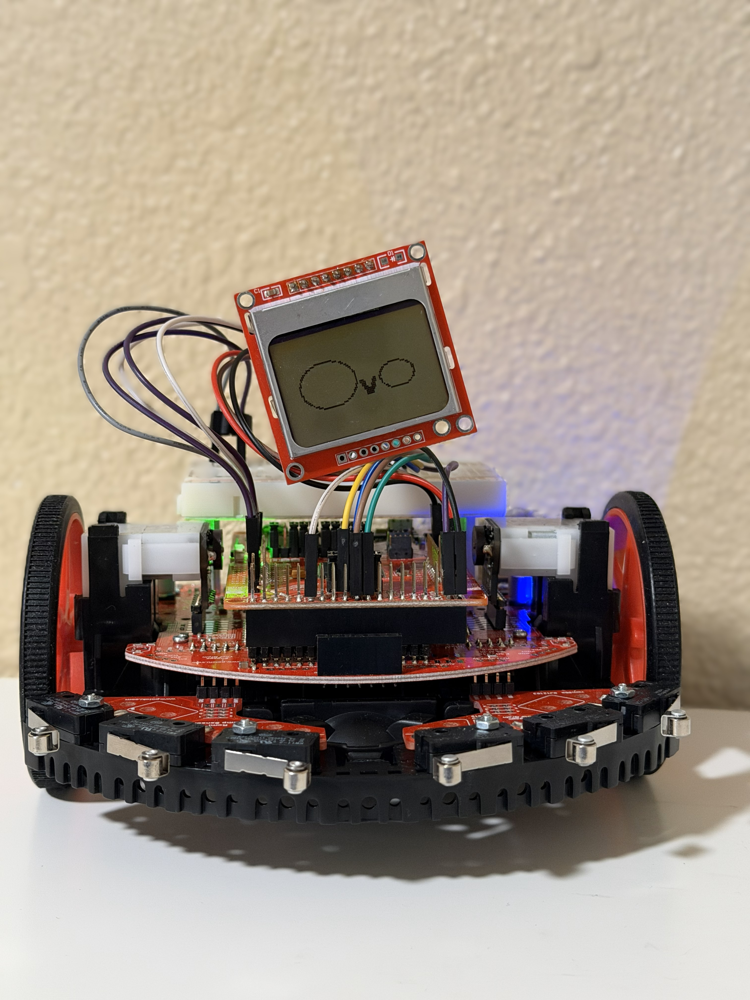

# Introduction
Ovo is a remote-controlled robot equipped with an LCD that displays different faces. Using the control pad, users can move Ovo forward, backward, left, and right, as well as play a short tune. Ovo is controlled wirelessly via Bluetooth through the Bluefruit Connect app. This project was built with the MSP432 Launchpad, TI-RSLK MAX chassis, Bluetooth Low Energy module, a piezo buzzer, and the Nokia 5110 LCD Display. 

# Background and Methodology 

This project integrated several embedded systems concepts to achieve communication and control. A Bluetooth Low Energy module was used to enable wireless communication between the smartphone and microcontroller via UART, allowing users to control the robot's movements. Pulse Width Modulation (PWM) was implemented to control the DC motors. Serial Peripheral Interface communication was implemented to display images on the Nokia 5110 LCD. General-Purpose Input/Output (GPIO) pins were utilized to generate different frequencies for the piezo buzzer. 

# Block Diagram

# Components Used

|      Description          |    Quantity    |      Manufacturer        |
|:-------------------------:|:--------------:|:------------------------:|
|    MSP432 LaunchPad       |       1        |     Texas Instruments    |
|   TI-RSLK MAX Chassis     |       1        |          Pololu          |
|  USB-A to Micro-USB Cable |       1        |           N/A            |       
| Adafruit BLE UART Module  |       1        |         Adafruit         |
|   Nokia 1150 LCD Display  |       1        |        SparkFun          |
|        Piezo Buzzer       |       1        |           TDK            |

 
# Pinout Plan

|   Bluetooth Low Energy    |       MSP432 LaunchPad        | 
|:-------------------------:|:-----------------------------:|
|        MOD (Pin 1)        |            Pin P4.1           | 
|        CTS (Pin 2)        |           GND                 |
|        TXO (pin 3)        |    Pin P3.2 (PM_UCA2RXD)      |        
|        RXI (Pin 4)        |    Pin P3.3 (PM_UCA2TXD)       |
|        VIN (Pin 5)        |       VCC (3.3V)              |
|        RTS (Pin 6)        |       Not Connected           |
|        GND (Pin 7)        |            GND                |
|        DFU (pin 8)        |        Not Connected          |

|   Nokia 5110 LCD   |       MSP432 LaunchPad        |
|:-------------------------:|:-----------------------------:|
|        VCC       |             VCC (3.3V)        | 
|        SCE       |           GND                 |
|        RST        |    Pin P9.4 (SCE, Chip Enable)      |        
|        D/C       |    Pin P9.3 (Reset)        |
|        MOSI       |     Pin P9.7 (MOSI)              |
|        SCLK       |      Pin P9.5 (SCLK)          |
|        LED        |            Unconnected            |

|   Piezo Buzzer   |       MSP432 LaunchPad        |
|:-------------------------:|:-----------------------------:|
|      Buzzer   |            Pin P4.6           | 
|        Buzzer       |           GND                 |

# Ovo Faces
These are the faces I designed for Ovo.

# Video Demonstration Links

Ovo Driving: https://youtu.be/r4-ORKmzRS0

Ovo's Expressions: https://www.canva.com/design/DAG7bhxHWCQ/B5_Cf27sAy9gdtBTdjJQow/edit?utm_content=DAG7bhxHWCQ&utm_campaign=designshare&utm_medium=link2&utm_source=sharebutton

Piezo Buzzer - Tokyo Drift:https://www.canva.com/design/DAG7bsygZCc/PzzIqpFg-ZjRoki9gT7rlg/edit?utm_content=DAG7bsygZCc&utm_campaign=designshare&utm_medium=link2&utm_source=sharebutton

